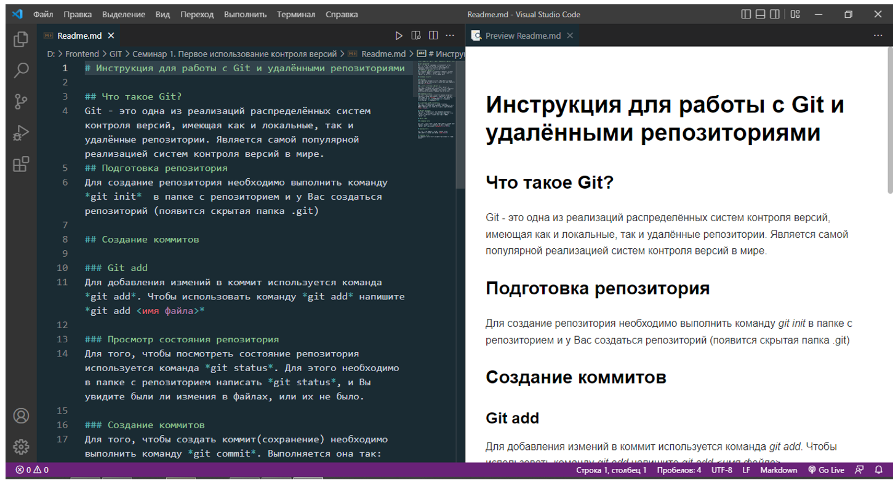

# Домашняя работа 3

## Задача:
Дополнить файл с инструкцией по работе с git (второе домашнее задание) 
и направить pull request в репозиторий преподавателя (указать ссылку на свой ЗАРАНЕЕ подготовленный для этого репозиторий).

https://github.com/gulden-geekbrains/version_control

Файл с инструкцией необходимо дополнить информацией о работе с удаленными репозиториями.
В системе подгрузить скриншот отправленного pull request

## Коментарии по решению:

#### Дополнить файл с инструкцией по работе с git (второе домашнее задание)

За основу "Домашней работы 3" взята наработка практики занятий "Домашней работы 2". Файл с инструкцией дополнить информацией о работе с удаленными репозиториями.
Готово.

#### Направить pull request в репозиторий преподавателя
https://github.com/gulden-geekbrains/version_control
(указать ссылку на свой ЗАРАНЕЕ подготовленный для этого репозиторий)

1. Зарегистрировался на GitHub
2. Создал там СВОЙ репозиторий https://github.com/kotosblade/gb_git_hw_3
3. Сделал форк https://github.com/gulden-geekbrains/version_control в СВОЙ репозиторий
4. Сделал клон СВОЙ репозиторий на локальный ПК
5. Создал ветку "hw_3" в которую поместил файлы ДЗ 3
6. Запушил изменения на GitHub
7. Написал pull request и сделал принтскрин

Готово.
#### В системе подгрузить скриншот отправленного pull request
Приложен на сайте
Готово.

# Домашняя работа 2

## Задача:
Продолжить работу с файлом, начатую на Семинаре 1. 
Создать и слить как минимум 4 ветки. 
Обязательно создать конфликт и разрешить его. 
Архив с репозиторием и проделанной работой приложить к уроку.

## Коментарии по решению:

#### Продолжить работу с файлом, начатую на Семинаре 1. 
Готово. За основу "Домашней работы 2" взята наработка практики занятий "Домашней работы 1" 

#### Создать и слить как минимум 4 ветки. Обязательно создать конфликт и разрешить его. 
Создал 4 ветки : branch_1, branch_2, branch_3, branch_4

##### Слияние 1
Ветка "branch_1":
- переименуем файл "Instruction_CLI.md" в "Instruction_CLI_mod.md", добавим в него немного текста
- коммит
- удалим файл "Instruction_CLI.md" из Git 
- коммит

Ветка "master":
- переименуем файл "Instruction_CLI.md" в "Instruction_CLI_777.md", добавим в него немного текста
- удалим файл "Instruction_CLI.md" из Git 
- коммит
- merge с branch_1 - все ок
- вернем файл "Instruction_CLI.md" в исходное состояние
- удалим ветку branch_1

##### Слияние 2
Ветка "branch_2":
- создадим новый файл "test.md", добавим в него немного текста
- коммит

Ветка "master":
- добавим новый файл изображения "test_img.jpg"
- коммит
- merge с branch_2 - все ок
- удалим ветку branch_2 и файлы "test.md и "test_img.jpg"

##### Слияние 3
Ветка "branch_3":
- отрелактируем текст в одном из блоков файла "Instruction_Git.md"
- коммит

Ветка "master":
- отрелактируем текст в одном из блоков файла "Instruction_Git.md"
- коммит
- merge с branch_3 - появляется конфликт
- решаем конфликт - раставит вручную, что оставлять
- коммит
- удаление branch_3

##### Слияние 4
Ветка "branch_4":
- дополним текст в файл "README.md"
- коммит

Ветка "master":
- merge с branch_4 - все ок
- текст с branch_4 файла "README.md" - добавился
- коммит
- удаление branch_4

Готово

#### Архив с репозиторием и проделанной работой приложить к уроку.
Готово

# Домашняя работа 1

## Задача:
Дооформить инструкцию по работе с Git, используя возможности Markdown (цитаты, картинки, ссылки и т.п.) и приложить свой проект в заархивированном виде (всю папку целиком).

Критерии проверки
Оценка “Отлично” - сдана папка с инициализированным git, в которой имеется файл markdown. Создано минимум два коммита.
Оценка “Хорошо” – сдана папка в которой отсутствует инициализированный git, однако, имеется рабочий файл markdown.
Оценка “Удовлетворительно” -  сдана папка, в которой отсутствует инициализированный git, файл markdown не рабочий.

Пример идеального решения

Коммиты можно проверить в папке студента по пути Folder/.git/logs/HEAD

## Коментарии по решению:
За основу "Домашней работы 1" взята наработка практики занятий 1 и 2 в виде конспектов проработано и размечено MarkDown :

[.gitignore](.gitignore) - пример работы gitignore

[Instruction_CLI.md](Instruction_CLI.md) - заметки по работе с CLI

[Instruction_MarkDown.md](Instruction_MarkDown.md) - заметки по работе с Markdown

В процессе работы добавлялись коммиты.

Дооформление файла [Instruction_Git.md](Instruction_Git.md) заметки по работе с Git сделано в стилистике эталонного решения
